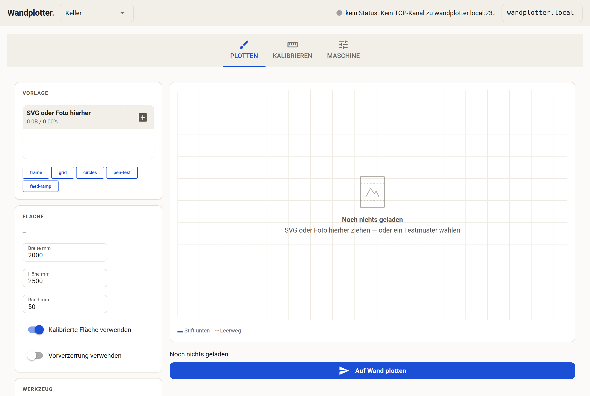
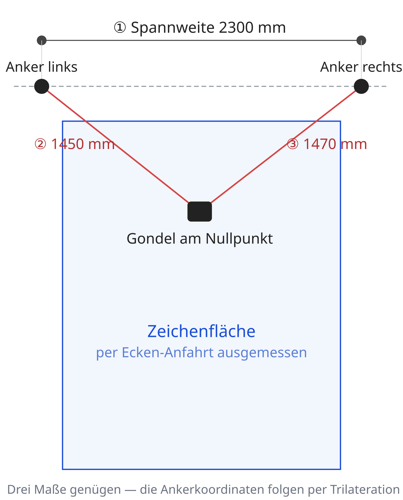
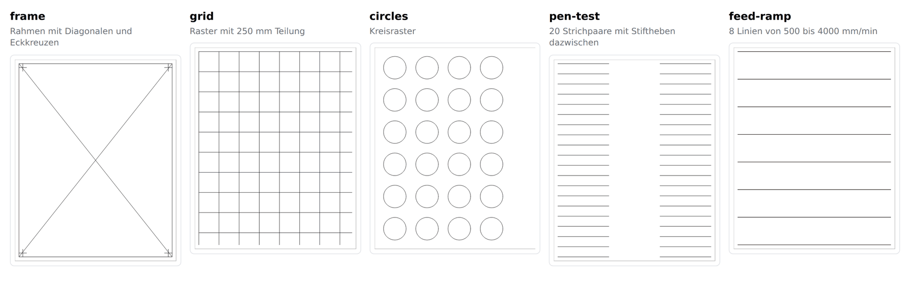
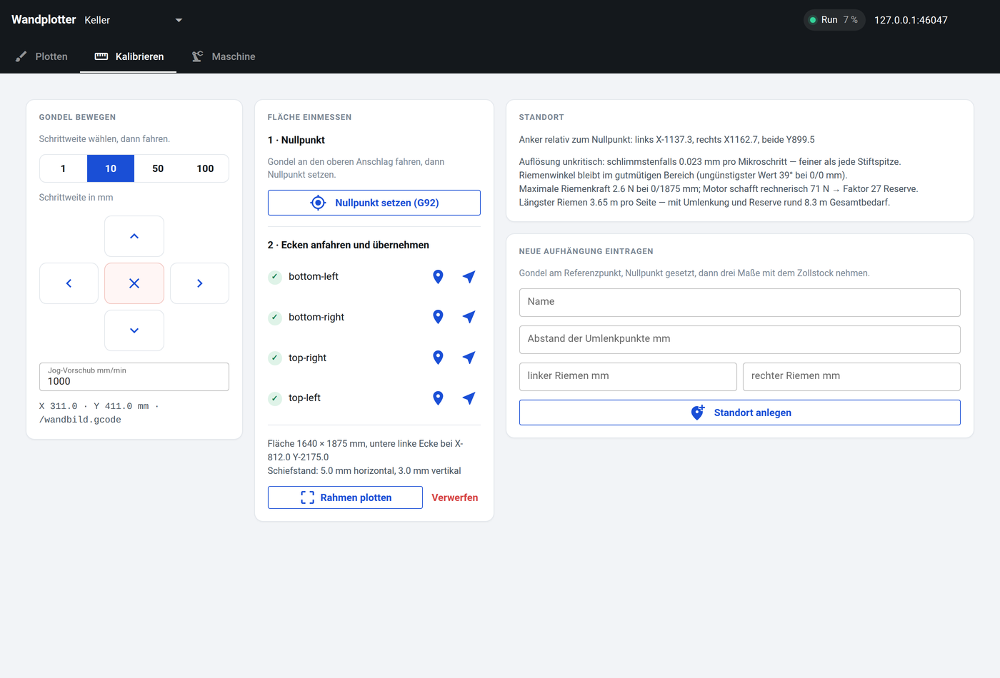
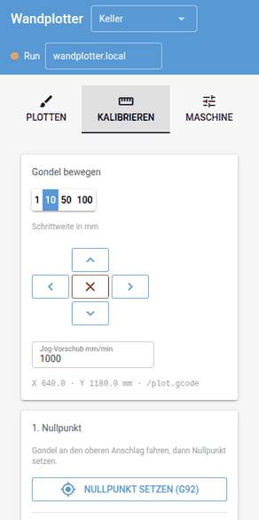
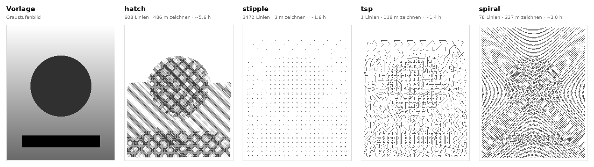

<h1 align="center">Wallplotter</h1>

<p align="center">
  Bild-zu-GCode-Toolchain für einen selbstgebauten V-Plotter, der Wandflächen bemalt.<br>
  Läuft mit <b>FluidNC</b> auf einem BIGTREETECH-Rodent-Board — SVG oder Foto rein,
  GCode auf die SD-Karte raus.
</p>

<p align="center">
  <a href="https://github.com/AndreasS964/Wallplotter/actions/workflows/ci.yml">
    </a>
  
  
  
</p>

<p align="center">
  
</p>

---

## Die Idee in einem Bild

Eine Gondel hängt an zwei Zahnriemen zwischen zwei Motoren. Wo genau die Anker
sitzen, ist nicht fest — der Plotter soll an wechselnden Wänden hängen. Deshalb
wird jede Aufhängung eingemessen statt angenommen: **drei Maße mit dem
Zollstock**, den Rest rechnet die Software.

<p align="center">
  
</p>

```bash
wallplotter-location new Keller --span 2300 --left 1450 --right 1470
wallplotter-location config Keller     # fertiger kinematics-Block für FluidNC
wallplotter-location show              # Auflösung, Riemenkräfte, Riemenlänge
```

## Dokumentation

| Dokument | Inhalt |
| --- | --- |
| **[Projekthandbuch](docs/wandplotter-handbuch.md)** | **Alles an einer Stelle** — Hardware, Kinematik, Firmware, Abläufe, Qualität, offene Punkte |
| [Projektidee](docs/projektidee.md) | Hardware, Mechanik, Entscheidungen |
| [Software-Roadmap](docs/software-roadmap.md) | Stufenplan und UI-Architektur |
| [Kinematik-Auswertung](docs/kinematik.md) | gerechnete Zahlen für eine Beispielaufhängung |
| [FluidNC-Konfiguration](config/fluidnc-wallplotter.yaml) | kommentierte `config.yaml` fürs Rodent-Board |

## Warum eigener GCode-Export?

Die Makelangelo-Software erzeugt einen Marlin-spezifischen Dialekt (`M280`,
proprietäre `D`-Codes). FluidNC will GRBL: `G0`/`G1` zum Fahren, `M3 S<wert>` /
`M5` für den Pen-Lift-Servo am PWM-Pin. Genau das erzeugt `wallplotter.gcode` —
und sonst nichts.

## Installation

```bash
git clone https://github.com/AndreasS964/Wallplotter.git
cd Wallplotter
python -m venv .venv && source .venv/bin/activate
pip install -e ".[geometry,dev]"      # Kern + vpype + Tests
pip install -e ".[web]"               # zusätzlich für die Web-UI
pip install -e ".[photo]"             # zusätzlich für Fotos (nur Pillow)
pip install -e ".[hatch]"             # zusätzlich für Schraffur (zieht vpype, OpenCV & Co. nach)
```

Ohne die Extras funktionieren GCode-Export, Statistik, Vorschau und Upload —
nur das Einlesen von SVG/Bildern braucht vpype.

## Benutzung

### Standort einrichten

Der Plotter soll an wechselnden Wänden hängen — Ankerabstand und -höhe sind
deshalb keine Konstanten, sondern gehören zum jeweiligen Aufbau. Pro Standort
drei Maße mit dem Zollstock, alles Weitere folgt daraus:

```bash
wallplotter-calibrate --host 192.168.1.42 zero      # Gondel am Referenzpunkt
wallplotter-location new Keller --span 2300 --left 1450 --right 1470
wallplotter-location config Keller                  # Kinematikblock für die config.yaml
```

`--span` ist der Abstand der beiden Umlenkpunkte, `--left`/`--right` die
Riemenlängen vom jeweiligen Umlenkpunkt zur Gondel am Nullpunkt. Daraus fallen
die Ankerkoordinaten per Trilateration heraus — die kommen in die
`config.yaml`, nicht ins Repo.

`wallplotter-location list` zeigt alle Aufhängungen, `use <Name>` wechselt.
In der Web-UI steht die Auswahl oben in der Kopfzeile.

### Fläche einmessen

Wie groß die bemalbare Fläche ist, hängt ebenfalls am Aufbau — also nicht
messen, sondern anfahren:

```bash
wallplotter-calibrate --host 192.168.1.42 jog --dx -100 # Gondel bewegen
wallplotter-calibrate --host 192.168.1.42 record bottom-left
# ... die übrigen drei Ecken, dann:
wallplotter-calibrate show
plot bild.svg --location --upload --run
```

Die Ecken landen im aktiven Standort. Vier sind ideal (dann warnt das Tool auch
bei schiefer Aufhängung), zwei diagonale reichen. Das Ergebnis ist bewusst das
größte Rechteck *innerhalb* der angefahrenen Punkte: lieber etwas kleiner als
neben der Wand. `wallplotter-location show` rechnet dann Auflösung, Riemenkräfte
und Riemenlänge für genau diese Fläche durch.

### Werkzeug wählen

Was unten an der Gondel hängt, ist keine Konstante. Der Katalog liefert
Startwerte je Stiftsorte:

```bash
plot --list-toolheads                  # was es gibt und mit welchen Werten
plot bild.svg --toolhead marker        # dickerer Strich, längere Servo-Wartezeit
plot bild.svg --toolhead pinsel --pen-dwell 0.6   # Katalogwert nachjustieren
```

Die Zahlen sind **geschätzte Startwerte**, keine Messwerte — Servohebel,
Federweg und Halter sind an jedem Aufbau anders. Nachgezogen wird mit
`plot --pattern pen-test`: fehlende Strichanfänge heißen zu kurze Wartezeit,
ausgefranste Enden zu viel Anpressdruck.

### Mehrfarbig plotten

```bash
plot bild.svg --layers                 # je Strichfarbe eine GCode-Datei
plot bild.svg --layers --one-file      # eine Datei, M0-Pause zum Stiftwechsel
plot bild.svg --layers --pen-for '#000000=fineliner' --pen-for '#e02020=marker'
```

Getrennt ist für mehrstündige Plots das Vernünftige: Schwarz heute, Rot
morgen. Alle Ebenen werden *gemeinsam* eingepasst — würde jede für sich
skaliert, fiele die Zeichnung auseinander. Mit `--pen-for` bekommt jede Farbe
ihren eigenen Stift samt Servo-Werten und Vorschub; die `M0`-Pause nennt dann
Farbe *und* Stift.

### Laser

Vorbereitet, aber an keiner Hardware erprobt — vor dem ersten scharfen Schuss
gehört das erzeugte Programm gelesen, nicht geglaubt.

```bash
plot bild.svg --toolhead laser --laser-verstanden \
     --laser-smax 1000 --laser-power 35 --laser-passes 2
```

`--laser-smax` steht in der `speed_map` der `config.yaml` und ist je nach
Aufbau 255 oder 1000; die Leistung wird in Prozent davon gerechnet. Ohne
`--laser-verstanden` entsteht kein Laser-GCode, und `--travel-as-g1` wird
zusammen mit einem Laser *verweigert* statt bloß bemängelt: ein G1-Leerweg
führte mit eingeschaltetem Strahl quer über die Wand.

Stift und Laser können nicht denselben Pin und nicht dieselbe PWM-Frequenz
benutzen (50 Hz gegen Kilohertz). Die `config.yaml` trägt den zweiten
Spindelblock auskommentiert bei.

### Abgebrochenen Plot fortsetzen

Ein Wandbild läuft Stunden; irgendwann bricht ein Lauf ab.

```bash
wallplotter-resume wand.gcode --from-board --host 192.168.1.42
wallplotter-resume wand.gcode --percent 42        # oder von Hand geschätzt
```

Angesetzt wird am Anfang des angefangenen Strichs, nicht exakt an der
Abbruchstelle: FluidNC meldet den Fortschritt in gelesenen Bytes, und der
Planer liest der Mechanik voraus — lieber einen Strich doppelt als einen gar
nicht. Vor dem Start muss der Nullpunkt wieder stehen.

### Nachmessen und gegenrechnen

Über drei Meter Länge ist ein GT2-Riemen eine Feder. Was davon übrig bleibt,
lässt sich messen und vorverzerren:

```bash
wallplotter-correct raster --steps 4 -o raster.gcode   # 16 Kreuze plotten
wallplotter-correct messen --steps 4                   # Vorlage zum Eintragen
# Ist-Werte mit dem Zollstock nachtragen, dann:
wallplotter-correct anpassen                           # → korrektur.json
plot bild.svg --correction korrektur.json
```

Der Anpassungsschritt sagt, wieviel die Korrektur überhaupt wegnimmt. Wird der
Fehler nicht deutlich kleiner, war zu grob gemessen oder das Modell passt
nicht — dann ist die Mechanik die richtige Antwort, nicht die Software.

### Wenn etwas nicht geht

```bash
wallplotter-doctor --host 192.168.1.42
```

Geht die Kette einmal von vorn nach hinten durch: Installation, Kern,
Standort, Firmware-Konfiguration, Board. Prüft dabei auch, ob die Ankermaße
in der `config.yaml` noch zu denen des aktiven Standorts passen — genau da
wird ein Wandbild unbemerkt schief.

Wenn das Board zwischen zwei Farben aus war, ist der Nullpunkt weg — `G92`
ist flüchtig. Zwei Wege zurück:

```bash
# sofort: kalibrierte Ecke anfahren und den Nullpunkt darüber wiederherstellen
wallplotter-calibrate goto bottom-left
wallplotter-calibrate zero --corner bottom-left

# dauerhaft: als G54-Versatz ablegen, der im NVS des ESP32 überlebt
wallplotter-calibrate zero --persistent
```

Der G54-Weg trägt allerdings nur zusammen mit einer *reproduzierbaren*
Referenzfahrt — ohne Homing ist die Maschinenposition nach dem Einschalten
willkürlich, und ein gespeicherter Versatz zeigt dann ins Leere. Das Rodent
kann sensorloses StallGuard-Homing; die `config.yaml` erklärt beide Varianten.

In der Web-UI erscheinen die Farbebenen mit Farbfeld unter der Vorschau, jede
einzeln startbar.

### Daten auf der SD-Karte

Der Plotter wandert zwischen Wänden — dann sollen die Standortdaten
mitwandern statt auf einem Rechner zu liegen:

```bash
wallplotter-location push --host 192.168.1.42   # Standorte auf die Karte
wallplotter-location pull --host 192.168.1.42   # und wieder zurück
```

Bewusst ohne automatisches Zusammenführen: Welcher von zwei auseinander
gelaufenen Ständen der richtige ist, kann nur entscheiden, wer dabei war.

### Testmuster

```bash
plot --list-patterns
plot --pattern frame --location --upload --run
plot --pattern feed-ramp --out out/tempo.gcode
```



`frame` (Rahmen, Diagonalen, Eckkreuze), `grid` (Maßstab nachmessen),
`circles` (Verzerrung), `pen-test` (Servo-Wartezeit), `feed-ramp` (Tempo bis
zum Riemenspringen).

### CLI

```bash
plot examples/testmuster.svg --out out/test.gcode --preview out/test-preview.svg
plot examples/testmuster.svg --host 192.168.1.42 --upload --run
plot foto.jpg --technique tsp                      # Foto-Zweig
```

Wichtige Optionen: `--width/--height/--margin` (Fläche in mm), `--draw-feed`,
`--pen-down/--pen-up` (S-Werte des Servos), `--travel-as-g1` (Leerwege langsam
fahren, falls die Riemen springen), `--occult` (verdeckte Linien entfernen).
`plot --help` zeigt alles.

Standardmäßig würfelt vpypes `reloop` den Startpunkt geschlossener Kurven, damit
der Stiftansatz nicht als Punktmuster sichtbar wird — derselbe Input ergibt
dadurch nicht denselben GCode. Zum Vergleichen zweier Läufe `--no-reloop`.

### Web-UI

```bash
python -m wallplotter.webapp
```

Erreichbar unter `http://<pc-ip>:8080` — auch vom Handy an der Wand. Drei
Reiter für die drei Situationen vor der Wand:

* **Plotten** — Upload oder Testmuster, Flächen- und Stiftparameter, Vorschau
  (Zeichenwege blau, Leerwege rot gestrichelt), Plot starten
* **Kalibrieren** — Jog-Pad, Nullpunkt setzen, Ecken übernehmen und wieder
  anfahren, Schiefstandswarnung, Standort anlegen samt Kinematik-Urteil
* **Maschine** — SD-Fortschritt, Pause/Weiter/Stopp

Auf dem Handy stapeln sich die Karten, das Jog-Pad steht dabei oben.

<table>
<tr>
<td width="70%"></td>
<td width="30%"></td>
</tr>
<tr>
<td align="center"><sub>Kalibrieren: Jog-Pad, Ecken, Standort samt Kinematik-Urteil</sub></td>
<td align="center"><sub>… und auf dem Handy an der Wand</sub></td>
</tr>
</table>

### Als Bibliothek

```python
from wallplotter import PlotConfig, lines_to_gcode, upload_and_run
from wallplotter.pipeline import svg_to_lines

lines = svg_to_lines("bild.svg")
gcode = lines_to_gcode(lines, PlotConfig(width_mm=2000, height_mm=2500, margin_mm=50))
upload_and_run(gcode, "bild.gcode")
```

## Druckqualität

Nachgerechnet mit der eigenen Kinematik (`docs/kinematik.md`): Die Auflösung
(0,013 mm) und die Segmentierung (0,0003 mm) sind *nicht* der Flaschenhals —
die **Riemendehnung** ist es, mit 0,12 bis 0,83 mm über die Fläche. Daraus
folgt:

* **Riemen mit Stahlkern** statt Glasfaser drückt das um Faktor 5 (0,83 → 0,17 mm).
  Der billigste und wirksamste Hebel, und einer, der vor dem Kauf entschieden
  werden will. Steifer geht immer — HTD 5M oder Stahlseil kämen auf 0,06 bzw.
  0,02 mm — lohnt aber nicht: der Rest liegt längst unter der Strichbreite
  eines Filzstifts, und Seil auf Trommel handelt sich veränderlichen
  Wickelradius und Schlupf ein.
* Nebenwirkung, die genauso zählt: Der Riemen bildet mit der Gondel einen
  **Längsschwinger**. Glasfaser landet bei rund 22 Hz — und 1500 mm/min bei
  1 mm Segmentlänge regen mit 25 Hz genau dort an. Stahlkern verschiebt das
  auf 50 Hz. Zusätzlich hilft `segment_length: 2` in der Firmware: kostet nur
  1 µm Bahntreue und halbiert die Anregung.
* `wallplotter.correction` rechnet den Rest gegen: entweder physikalisch aus
  den Zugkräften (`StretchCorrection`, ein Materialwert, aus Messpunkten
  bestimmbar) oder empirisch aus einem nachgemessenen Raster
  (`MeasuredCorrection`, Polynom bis Grad 3). Das Modell gewinnt deutlich —
  ein angepasster Materialwert schlägt zehn Polynomkoeffizienten.
* Die Gondel ist ein **Pendel** mit 1,3–2 Hz. Trifft die Umkehrfrequenz einer
  Schraffur diesen Bereich, werden die Linien wellig; `wallplotter.motion`
  warnt vorher und nennt zwei Auswege.

### Verfahren für Fotos

Für Bildvorlagen entscheidet das Verfahren mehr als die Mechanik:

```bash
plot --list-techniques
plot foto.jpg --technique spiral --pitch 25
```

| Verfahren | Charakter | Stifthübe |
| --- | --- | --- |
| `hatch` | Schraffur nach Helligkeitsstufen, grafisch | viele |
| `stipple` | Punktraster, fotografisch | einer je Punkt |
| `tsp` | dieselben Punkte als eine durchgehende Linie | keine |
| `spiral` | Spirale mit dunkelheitsabhängiger Auslenkung | keine |



`tsp` und `spiral` zeichnen ohne abzusetzen — damit entfallen Servo-Artefakte
und die Pendelstöße durch Leerfahrten ganz. Die Zeitangaben gelten für
2 × 2,5 m bei 1500 mm/min.

## Aufbau

| Modul | Aufgabe |
| --- | --- |
| `wallplotter.config` | Wandmaße, Vorschübe, Pen-Servo-Werte, FluidNC-Zugang |
| `wallplotter.geometry` | Bounding-Box, Einpassen, Spiegeln, Längen-/Zeitschätzung (ohne vpype) |
| `wallplotter.pipeline` | SVG/Bild → Linien in mm (vpype), plus SVG-Vorschau |
| `wallplotter.gcode` | Linien → GCode (`G0`/`G1`, `M3`/`M5`) |
| `wallplotter.upload` | FluidNC-Web-API: Upload, `$SD/Run`, Status, Pause/Stop |
| `wallplotter.kinematics` | Auflösung, Riemenlängen, Zugkräfte nachrechnen |
| `wallplotter.calibration` | angefahrene Ecken → nutzbare Fläche mit Versatz |
| `wallplotter.location` | Standorte: Ankermaße + Fläche je Aufhängung |
| `wallplotter.sdstore` | Standortdaten auf der SD-Karte des Boards |
| `wallplotter.patterns` | Testmuster für die Erstinbetriebnahme |
| `wallplotter.imaging` | Fotos → Linien: hatch, stipple, tsp, spiral |
| `wallplotter.correction` | Vorverzerrung gegen Riemendehnung und Messfehler |
| `wallplotter.motion` | Pendelresonanz, positionsabhängiger Vorschub |
| `wallplotter.cli` | Stufe 2 der Roadmap |
| `wallplotter.calibrate_cli` | Jog, Nullpunkt, Ecken aufnehmen |
| `wallplotter.location_cli` | Standorte anlegen, wechseln, Kinematikblock ausgeben |
| `wallplotter.webapp` | Stufen 3–6 der Roadmap (NiceGUI) |

CLI und Web-UI nutzen dieselben Funktionen — es gibt bewusst keine zweite
Pipeline.

## Tests

```bash
pytest
```

Tests, die vpype, NiceGUI oder PyYAML brauchen, überspringen sich selbst, wenn
das Paket fehlt — der Rest läuft immer.

## Stand

Board unterwegs, Mechanik noch nicht gedruckt. Was das heißt:

* **Verifiziert ohne Hardware:** Geometrie, GCode-Export, Kalibrierlogik,
  Testmuster, Kinematikrechnung, UI-Verdrahtung — alles unter Test.
* **Noch offen bis das Board da ist:** die ESP3D-Endpunkte (`/sdfiles`,
  `/sd/`, `/command`) sind nach Dokumentation gebaut, aber nie gegen echte
  Firmware gelaufen; die Servo-S-Werte für Pen-Up/Down sind Platzhalter; und der
  PWM-Pin für den Servo in der `config.yaml` ist der einzige geratene Wert
  (siehe Kommentar dort — der 3–10-V-Ausgang des Rodent passt womöglich nicht
  zu einem MG90S).

## Lizenz

MIT — siehe [LICENSE](LICENSE).
